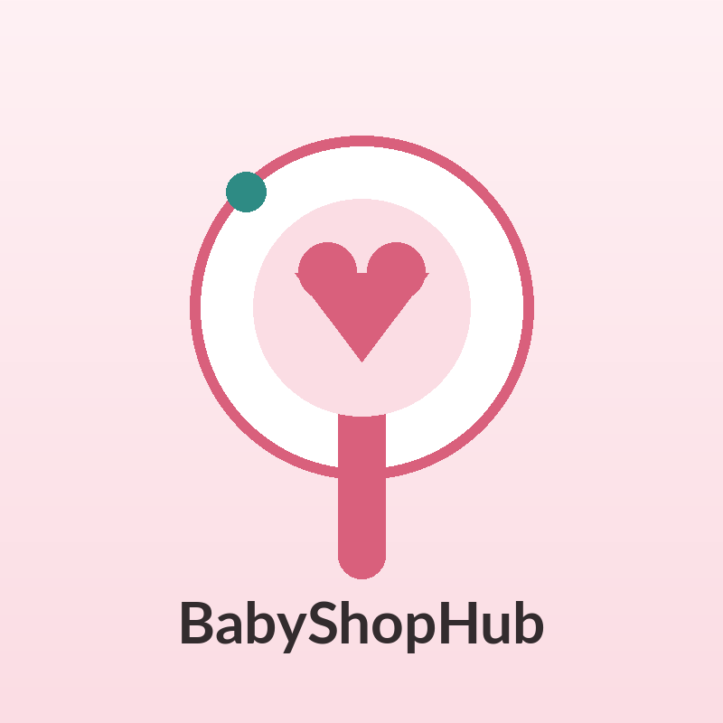
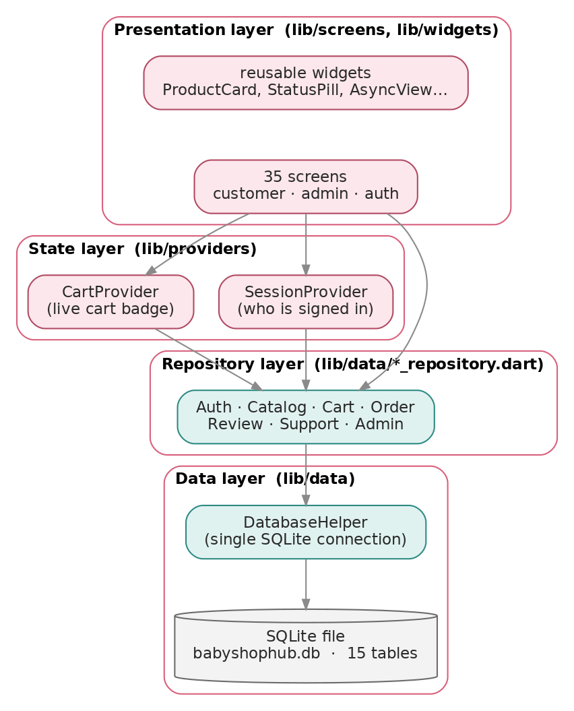
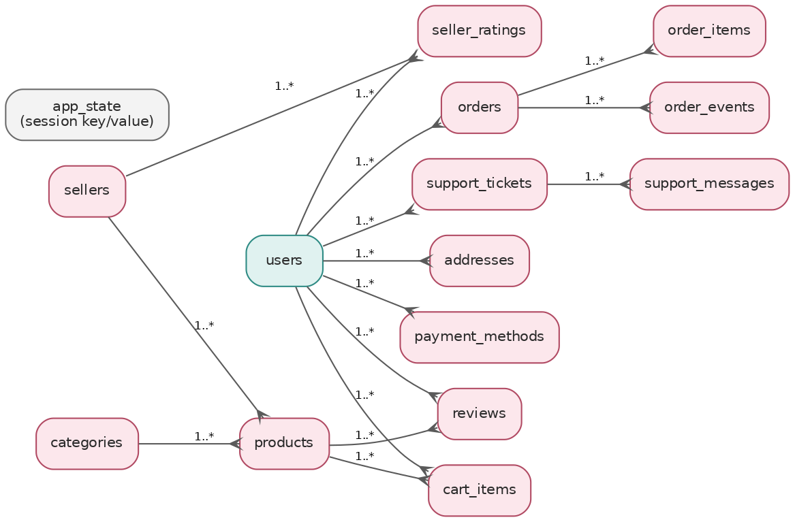

<div align="center">



# BabyShopHub

**An offline-first baby-products shopping app built with Flutter — a full storefront, an admin back office, and a local SQLite database, with no server and no network calls.**


</div>

---

## Overview

BabyShopHub is a shopping application for infant products — diapers, baby food, clothing, bath items, feeding equipment, and toys. A parent or carer can browse the catalogue, search, read and write reviews, manage a cart, place an order through a simulated payment step, and track that order to delivery. A shop administrator gets a back office to manage products, categories, orders, users, reviews, and customer support.

The application runs **entirely on the device**. Every account, product, order, review, and support message lives in a local SQLite database — there is no server, no external API, and no network request anywhere in the product. This is a deliberate design decision: the system is self-contained, fully demonstrable offline, and free of any running cost, while still exercising every feature of the brief.

> Built as an Aptech eProject. The full governing documents — SRS, System Design, Test Plan and more — are in [`docs/`](docs/).

## The problem it solves

Parents shopping for baby products need a focused, trustworthy storefront: clear categories, honest reviews, a simple cart and checkout, and order tracking — without the noise of a general marketplace. Shop owners need a matching back office to keep the catalogue, orders, and customer questions under control. BabyShopHub delivers both sides as one coherent, easy-to-use app that a non-technical person can operate without instruction.

## Features

### Shopper (storefront)

- **Accounts** — register, log in, stay signed in across restarts, edit your profile, and manage saved delivery addresses and payment cards. Passwords are stored only as salted SHA-256 hashes.
- **Catalogue & search** — browse a seeded catalogue of 40 products across 8 categories, search by name, filter and sort, and open a rich product detail page.
- **Reviews & ratings** — read reviews and ratings on each product and write your own.
- **Cart** — add items, change quantities, and remove them, with a running total in Naira (₦).
- **Checkout** — a simulated (dummy) payment step that validates card input but moves no money, then confirms the order.
- **Orders** — view your order history and track each order through its delivery stages.
- **Support** — raise and read support tickets from inside the app.

### Administrator (back office)

- **Dashboard** — an at-a-glance view of the shop.
- **Products & categories** — full create, edit, and delete control over the catalogue.
- **Orders** — review orders and advance their status.
- **Users** — manage registered customers.
- **Reviews** — moderate customer reviews.
- **Support** — answer the customer support queue.

Roles are enforced: a customer can never reach an admin screen, and an administrator is routed to the back office on login.

## Architecture & data model

BabyShopHub follows a layered architecture — a presentation layer of screens and reusable widgets, a state layer using the Provider pattern, a repository layer that expresses every data operation as a method, and a single SQLite database underneath.

<div align="center">

<br/><br/>

</div>

## Tech stack

| Area | Choice |
|------|--------|
| Framework | Flutter (Dart) |
| Database | SQLite — `sqflite` on mobile, `sqflite_common_ffi` + `sqlite3_flutter_libs` on desktop |
| State management | `provider` (ChangeNotifier) |
| Security | `crypto` — salted SHA-256 password hashing |
| Paths | `path` — locates the on-device database file |

No cloud service, remote API, or network request is used anywhere in the app.

## Getting started

> **Prerequisite:** a working Flutter installation. If you are starting from a clean Windows PC with nothing installed, follow the step-by-step [Windows Setup Guide](docs/src/01-setup-guide.md) instead — it is written for a non-technical reader and takes you from an empty PC to the running app.

This repository tracks **source only** — the generated platform runner folders (`windows/`, `android/`, …) are intentionally not committed. Regenerate them once after cloning:

```bash
git clone https://github.com/undisputedbill03-blip/BabyShopHub.git
cd BabyShopHub
flutter create .          # regenerates the platform runners (one time)
flutter pub get           # fetches dependencies
flutter run -d windows    # launch on Windows desktop
```

To run on an Android device or emulator instead, use `flutter run -d <device>`; see Appendix A of the Setup Guide.

### Demo accounts

The database is seeded on first launch. Sign in with:

| Role | Email | Password |
|------|-------|----------|
| Customer | `parent@babyshophub.com` | `Parent@123` |
| Administrator | `admin@babyshophub.com` | `Admin@123` |

## Project structure

```
lib/
├── core/        # theme, colours, text styles, spacing, app config
├── models/      # plain Dart data models (products, orders, users, …)
├── data/        # SQLite database, seed data, and the repositories
├── providers/   # Provider / ChangeNotifier state (auth, cart, …)
├── screens/     # customer + admin screens
├── widgets/     # reusable UI components
└── main.dart    # entry point
assets/          # brand logo and product imagery
docs/            # SRS, System Design, Test Plan, guides (.docx, .pdf, .md)
```

## Documentation

Full project documentation lives in [`docs/`](docs/) — each is provided as a formatted PDF/Word document and as a readable Markdown source:

| Document | Read on GitHub | Formatted |
|----------|----------------|-----------|
| Windows Setup Guide | [source](docs/src/01-setup-guide.md) | [PDF](docs/01-BabyShopHub-Setup-Guide.pdf) |
| Software Requirements Specification (SRS) | [source](docs/src/02-srs.md) | [PDF](docs/02-BabyShopHub-SRS.pdf) |
| System Design | [source](docs/src/03-system-design.md) | [PDF](docs/03-BabyShopHub-System-Design.pdf) |
| User Guide | [source](docs/src/04-user-guide.md) | [PDF](docs/04-BabyShopHub-User-Guide.pdf) |
| Developer Guide | [source](docs/src/05-developer-guide.md) | [PDF](docs/05-BabyShopHub-Developer-Guide.pdf) |
| Test Plan | [source](docs/src/06-test-plan.md) | [PDF](docs/06-BabyShopHub-Test-Plan.pdf) |

## Design decisions & constraints

- **On-device only** — no server, API, or network call; all data is local SQLite.
- **Simulated payment** — checkout validates input and confirms the order but never moves real money.
- **Security** — passwords are never stored in plain text; only salted SHA-256 hashes are kept.
- **One consistent design** — a single theme system (colours, typography, spacing) applied across every screen, usable by a non-technical audience.
- **Currency** — prices are shown in Nigerian Naira (₦).

## License

Produced as an academic Aptech eProject submission.
